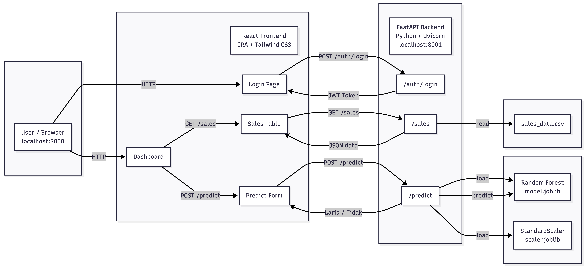

# AI Sales Prediction System

Mini sistem untuk mengelola data penjualan dan memprediksi status produk (Laris / Tidak Laris) menggunakan Machine Learning.

## System Design



### Alur Data

1. **Login** - User mengirim credentials ke `POST /auth/login`, backend return JWT token
2. **Ambil Data** - Frontend mengakses `GET /sales` dengan JWT, backend membaca CSV
3. **Prediksi** - Frontend mengirim data produk ke `POST /predict`, backend load model ML dan return prediksi

## Tech Stack

| Komponen | Teknologi |
|---|---|
| Frontend | React (CRA), Tailwind CSS v4, Axios |
| Backend | Python, FastAPI, python-jose (JWT) |
| ML | Scikit-learn (Random Forest), Pandas, NumPy |

## Cara Menjalankan

### Opsi 1: Docker (Recommended)

```bash
docker compose up -d --build
```

Akses:
- Frontend: http://localhost:3000
- Backend API docs: http://localhost:8001/docs

Untuk menghentikan:
```bash
docker compose down
```

### Opsi 2: Manual

```bash
cd ml
pip install -r requirements.txt
python train_model.py
```

Script ini akan:
- Membaca `data/sales_data.csv`
- Preprocessing (StandardScaler)
- Training Random Forest Classifier
- Evaluasi (accuracy, classification report)
- Simpan `model.joblib` dan `scaler.joblib`

### Manual

#### Prerequisites

- Python 3.9+
- Node.js 16+
- npm

#### 1. Train ML Model

```bash
cd ml
pip install -r requirements.txt
python train_model.py
```

#### 2. Jalankan Backend

```bash
cd backend
pip install -r requirements.txt
uvicorn app.main:app --reload --port 8001
```

API docs tersedia di: http://localhost:8001/docs

#### 3. Jalankan Frontend

```bash
cd frontend
npm install
npm start
```

Frontend berjalan di: http://localhost:3000

### Default Login

- **Username:** `admin`
- **Password:** `admin123`

## API Endpoints

| Method | Endpoint | Deskripsi | Auth |
|---|---|---|---|
| POST | `/auth/login` | Login, return JWT token | No |
| GET | `/sales` | Ambil semua data penjualan | Yes |
| POST | `/predict` | Prediksi status produk | Yes |

### POST /auth/login

```json
// Request
{ "username": "admin", "password": "admin123" }

// Response
{ "access_token": "eyJ...", "token_type": "bearer" }
```

### POST /predict

```json
// Request
{ "jumlah_penjualan": 150, "harga": 100000, "diskon": 10 }

// Response
{ "status": "Laris", "confidence": 0.99 }
```

## Struktur Project

```
goodeva/
├── data/
│   └── sales_data.csv
├── ml/
│   ├── train_model.py          # Training script
│   ├── model.joblib            # Trained model
│   ├── scaler.joblib           # Feature scaler
│   └── requirements.txt
├── backend/
│   ├── app/
│   │   ├── main.py             # FastAPI app entry
│   │   ├── config.py           # Configuration
│   │   ├── dependencies.py     # JWT auth dependency
│   │   ├── routers/
│   │   │   ├── auth.py         # Login endpoint
│   │   │   ├── sales.py        # Sales data endpoint
│   │   │   └── predict.py      # Prediction endpoint
│   │   ├── services/
│   │   │   ├── auth_service.py
│   │   │   ├── sales_service.py
│   │   │   └── predict_service.py
│   │   ├── models/
│   │   │   └── schemas.py      # Pydantic models
│   │   └── utils/
│   │       └── error_handlers.py
│   └── requirements.txt
├── frontend/
│   └── src/
│       ├── api/                # Axios instance + API calls
│       ├── components/         # React components
│       ├── context/            # Auth context
│       ├── App.js              # Router setup
│       └── index.js
└── README.md
```

## Design Decisions

1. **Random Forest** - Dipilih karena robust terhadap non-linear relationships dan tidak sensitif terhadap scaling. Hasil: 100% accuracy (data sangat separable berdasarkan jumlah_penjualan).

2. **StandardScaler** - Diterapkan meskipun Random Forest tidak memerlukannya, sebagai good practice jika model diganti (misal Logistic Regression).

3. **FastAPI** - Auto-generate Swagger docs, type hints, async support, dan performa tinggi.

4. **JWT Dummy Auth** - Menggunakan hardcode credentials sesuai brief. Di production, gunakan database dan password hashing.

5. **React Context** - Cukup untuk state management pada project kecil ini. Tidak perlu Redux.

6. **Tailwind CSS v4** - Menggunakan `@import "tailwindcss"` syntax tanpa config file (v4 default).

## Asumsi

- Dataset CSV sudah bersih, tidak perlu data cleaning
- Hanya 1 user dummy untuk authentication
- Model di-train sekali (offline), hasilnya di-load oleh backend saat runtime
- Tidak ada database - data penjualan langsung dibaca dari CSV
- `jumlah_penjualan` bernilai 0 berarti tidak ada penjualan (produk tidak laris)
- Threshold untuk "Laris" sepertinya berada di sekitar jumlah_penjualan > 100 (berdasarkan pola data)
